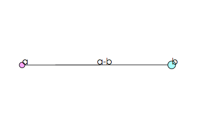

# d3graph

A javascript graph visualization lib base on d3.js.

d3graph automatically layout the graph with layers. And the history layout can be remembered so that the change of the graph can be visualized with an animation.



## Usage

Call function `d3graph` to create a graph object, which provide following interfaces:

- addNode(nodeId, data)
- delNode(nodeId)
- addEdge(edgeId, srcId, dstId, data)
- delEdge(edgeId)
- redraw(duration, ease)

`addNode(nodeId, data)` creates a new node indexed with `nodeId`, `addEdge(edgeId, srcId, dstId, data)` creates a directed edge from `srcId` to `dstId`, indexed with `edgeId`. The last parameter `data` will be sent to a callback to visualize the node or edge respectively.

`redraw(duration, ease)` resolve the layout of nodes and edges, and draw them in the container with user provided callbacks. With `duration` parameter, an animation will be launched to visualize the transition from the last layout to the current one. `duration` defines animation time in milliseconds, and `ease` defines the interpolate method, which is `cos` by default. See [d3.js document](https://github.com/mbostock/d3/wiki/Transitions#ease) for details. Call redraw() with no parameters just to draw the new graph.

d3graph take 5 parameters:

- container
- width
- height
- drawNode(group, data)
- drawEdge(path, group, data)

Container is a selector where the graph should appear, typically a div. Width and height define the size of the visualization area. `drawNode` and `drawEdge` are callbacks defines how to draw nodes and edges.

d3graph will automatically resolve the layout of nodes and edges. For each node, a group will be created at the corresponding position, and passed to `drawNode` along with the `data` which is provided by `addNode`. For each edge, a `path` will be created according to the layout, also a `group` will be created at the middle of the `path`, both will be passed to `drawEdge`, along with the `data` provided by `addEdge`.

## Demo

The following script visualized as the above picture.

```javascript
let width = 800;
let height = 600;
var graph = d3graph(d3.select('#main'), // draw graph on the selected 'main' div
  width, height,
  function(group, data) { // drawNode function
    group.append('circle')
    .attr('r', data.size || 5)
    .attr('stroke','#000')
    .attr('fill', data.color || '#FFF');

    group.append('text')
    .text(data.text);
  },
  function(path, group, data) {
    // decorate path
    path.attr('stroke','#000')
    .attr('stroke-dasharray', data.dash || 'none');

    // draw something on the anchor
    group.append('text').text(data.text);
  }
);

graph.addNode('a', {text: 'a', size: 5, color: '#FAF'});
graph.addNode('b', {text: 'b', size: 7, color: '#AFF'});
graph.addEdge('a-b', 'a', 'b', {text: 'a-b'});
graph.redraw();


graph.addNode('c', {text: 'c', size: 3, color: '#FAA'});
graph.addEdge('a-c', 'a', 'c', {dash: [2,2]});
graph.redraw(500);

setTimeout(function() {
  graph.addEdge('a-c-2', 'a', 'c', {});
  graph.addEdge('b-c', 'b', 'c', {});
  graph.redraw(500);
}, 1500);
```

## Layout

d3graph draw nodes hierarchically with there topological order. There might be edges between nodes at the same level, while no edge will link non-neighboring levels.
